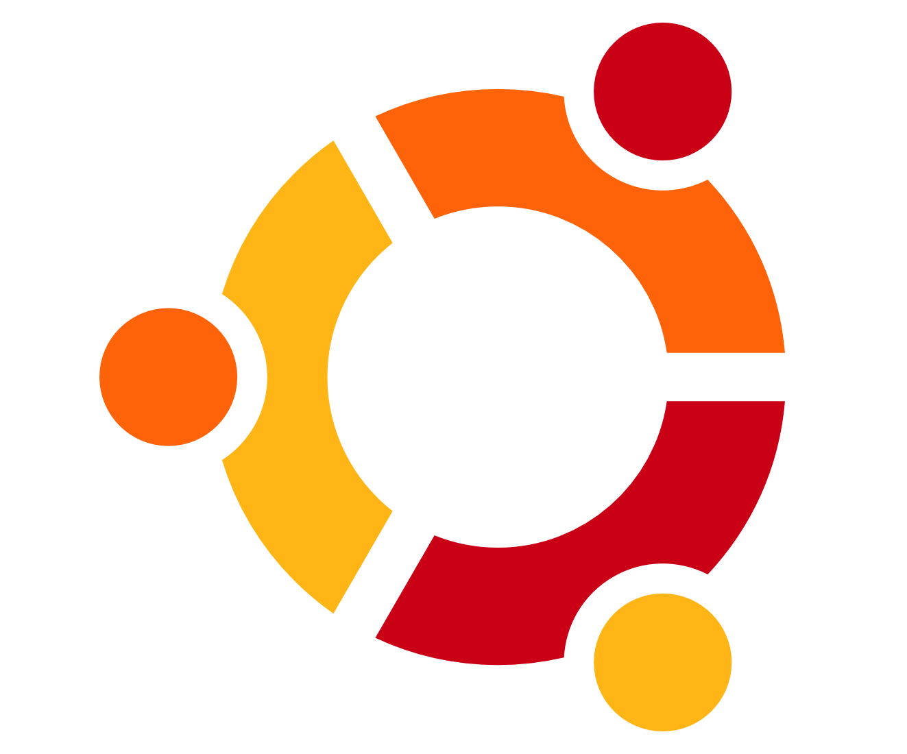

Como se mencionó en la sección [¿Qué es Linux?](¿Qué-es-Linux%3F), existen varias distros de Linux, cada una con un público objetivo en mente. A continuación te introducimos a algunas distros de más amigables a más técnicas:

### Principiante

| Distro                               | Info                                                                                                                                                                                             |                                                                             |
| ------------------------------------ | ------------------------------------------------------------------------------------------------------------------------------------------------------------------------------------------------ | --------------------------------------------------------------------------- |
| [Ubuntu](https://ubuntu.com/)        | Sin duda la distro más popular de Linux, y una muy recomendada para dar tus primero pasos.                                                                                                       |  |
| [Fedora](https://fedoraproject.org/) | Es la distro padre de Ubuntu, de hecho muchas distros son derivadas de Fedora. Asi que si sabes usar Fedora, muchas distros te serán sencillas, además que respeta más tu privacidad que Ubuntu. |  |
| [Mint](https://linuxmint.com/)       | Sumamente ligera, si tienes una computadora vieja, linux mint es una buena opción para darle una 2nda vida.                                                                                      |    |

### Moderadas

| Distro                               | Info                                                                                                                                                             |                                                                                |
| ------------------------------------ | ---------------------------------------------------------------------------------------------------------------------------------------------------------------- | ------------------------------------------------------------------------------ |
| [Manjaro](https://manjaro.org/)      | Se siente muy parecido a Windows. Pero sumamente customizable y ligero. Si quieres aprovecharla al máximo tendrás que aprender a usar archivos de configuración. |    |
| [Endevour](https://endeavouros.com/) | Igual de versatil que Manjaro, con la diferencia que Endevour ya cuenta con varios programas instalados que lo hacen muy estético.                               |  |

### Avanzadas

| Distro                               | Info                                                                                                                                                                                                                                                                                                                                                   |                                                                            |
| ------------------------------------ | ------------------------------------------------------------------------------------------------------------------------------------------------------------------------------------------------------------------------------------------------------------------------------------------------------------------------------------------------------ | -------------------------------------------------------------------------- |
| [Arch Linux](https://archlinux.org/) | Es sin duda la distro MAS CONFIGURABLE que existe, pero al costo de ser de las más técnicas. Instalar Arch, es instalar el mínimo software posible para arrancar tu PC. Será TU deber instalarle las utilidades para que pueda mostrar gráficos, emitir sonido o conectarse a internet.   Se puede aprender mucho de OS's con Arch. |  |
| [Nix Os](https://nixos.org/)         | Distro especialmente útil para programadores. Es genial porque concentra las configuraciones de TODOS tus programas en un solo archivo. Por lo que si un dia se corrompio tu PC, bastara con un simple comando para dejarlo todo TAL Y COMO ESTABA.                                                                                                    |   |
