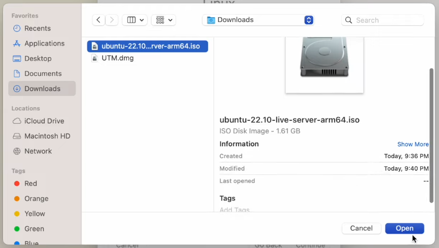

Existen muchas maneras de usar Linux, la forma de instalar el sistema operativo en sí es muy parecido entre cada una de ellas sin embargo la forma en la que se utiliza cambia, a continuación te mostramos las 3 principales:

- [Dual Booting](#dual-booting): Consideramos que esta es la mejor forma de instalar y usar Linux. Con esta forma se obtiene lo mejor de ambos mundos, puedes usar Linux cuando quieras sin perder tu sistema operativo original, así puedes regresar cuando gustes a tu entorno conocido.
- [Reemplazo del sistema original](#reemplazo-total-del-sistema): Con esta forma, reemplazas el sistema operativo de tu computadora por Linux, no la recomendamos para principiantes pues una vez se realiza *no hay marcha atrás*.
- [VM (Virtual Machine)](#virtual-machine): Esta forma solo es recomendable para probar una Distro o ver de qué va esto de Linux, no la recomendamos para uso diario o prolongado por más de unos pocos días.

# Instalación

Para poder instalar satisfactoriamente Linux es necesario que primero selecciones una distro a instalar, para esta guía utilizaremos Ubuntu como ejemplo sin embargo para todas las otras distros los pasos son muy parecidos.

1. Busca y descarga el .ISO de tu distro. En este caso como estamos instalando Ubuntu, sigue el link a su [página de descargas](https://ubuntu.com/download/desktop). Te recomendamos descargar la versión LTS (Long Term Support), pues es la versión que el equipo de Ubuntu mantendrá por varios años y es la más estable.

2. Una vez descargado el .ISO puedes utilizarlo directamente para crear una [VM (Virtual Machine)](#virtual-machine) o crear un USB Booting Device como te mostraremos más adelante.

## Creación del Booting Device

Esta es la parte más complicada de la instalación para la mayoría de las distros introductorias. Por favor lee atentamente todos los pasos y las opciones que te aparezcan en los popups de las aplicacioenes/páginas que visitaras.

Si estas en esta sección es porque deseas instalar Linux de forma [Dual Booting](#dual-booting) o [reemplazando al sistema original](#reemplazo-total-del-sistema). Para poder hacer esto se necesita una USB que tenga el instalador del sistema operativo a instalar, si alguna vez has instalado Windows en alguna máquina, esta USB es el equivalente al disco que había que insertar en las máquinas para instalarles Windows. Los pasos para crear esta USB (llamada USB Booting Device) varían si estás en Windows, Mac o Linux.

Es necesario que la USB que desees utilizar para volverla un Booting Device no tenga archivos que te importen, pues la conversión a un Booting Device los eliminará y no los podrás recuperar. Es importante notar que, después de la instalación, la USB puede ser regresada a su estado original y puede seguir siendo usada como cualquier USB normal, solo sigue los pasos de la sección [Regresar la USB booteable a la normalidad](#regresar-la-usb-booteable-a-la-normalidad)

Para crear una booting USB se necesita una USB, no necesita tener mucho almacenamiento, con 4-8GB es más que suficiente para la mayoría de distros, asegúrate que sea como mínimo un poco más grande que el .ISO que descargaste de tu distro. Hay varios programas que se pueden utilizar para crear un disco booteable:

* **Windows**: [Rufus](https://rufus.ie/en/) es el programa que mejor nos ha funcionado, es fácil de usar y no tiene virus.
* **Mac**: [Balena Etcher](https://etcher.balena.io/) es un programa muy sencillo pero útil, funciona perfecto en Mac aunque en Windows es posible que no funcione.

### Balena Etcher

Para crear el disco usando [Balena Etcher](https://etcher.balena.io/) sigue los siguientes pasos:

1. Selecciona la opción "Flash from file" y selecciona el .ISO de tu distro que descargaste.
   

2. Selecciona tu USB de la lista de USB's.
   

3. Da click a FLASH!.

Listo! Ya tienes una USB booting device desde la cual puedes comenzar a instalar Linux.

### Rufus

Para crear el disco usando [Rufus](https://rufus.ie/en/) sigue los siguientes pasos:

1. Selecciona el USB que quieres volver un bootable device.
   

2. Selecciona la opción de "Disk or ISO image" y da click en el botón de "SELECT" de la derecha.
   

3. Una vez seleccionada la ISO, presiona el botón de start.
   

Listo! Tu USB se está convirtiendo en un dispositivo desde el cual puedes instalar Linux.

Ahora que tienes tu booting device necesitas iniciar el proceso de instalación de Linux. Para esto puedes ir a las secciones de [Dual Booting](#dual-booting) o [Reemplazo total del sistema](#reemplazo-total-del-sistema) las cuales necesitan de este dispositivo para funcionar.

## Dual Booting

## Virtual Machine

### Procedimiento para MacBook

Después de haber realizado lo indicado en la sección de [Instalación](#Instalacion) deberás seguir los siguientes pasos para poder crear tu máquina virtual.

1. Asegúrate de tener por lo menos 40 GB de espacio disponible para la instalación de la máquina virtual.
2. Dirígete a la página oficial de [UTM](https://mac.getutm.app/), después presiona el botón *Download* y espera a que se termine de descargar el archivo.
3. Cuando ya tengas el archivo descargado, dirígete a la carpeta en donde se encuentra y haz doble clic sobre él, después arrastra el icono de UTM a la sección de aplicaciones.
4. Dirígete a la sección de aplicaciones y ejecuta la aplicación de UTM.
5. Después de ejecutar vas a encontrarte con la siguiente interfaz.
6. Haz clic en "Create a new virtual machine" y aparecerá la siguiente ventana. 
7. Para el siguiente paso debes de saber el procesador de tu MacBook, si tu MacBook utiliza un procesador M1 o M2 selecciona la opción de "Virtualize", en el otro caso que son los procesadores de Intel o AMD debes de elegir la opción de "Emulate".
8. En la ventana siguiente debes de elegir la opción correspondiente a Linux.
   
9. A continuación podrás ver la siguiente ventana, asegúrate de desmarcar la casilla de "Use apple virtualization", ahora debes de presionar el botón de "Browse". 
10. Después de presionar este botón se desplegará un explorador de archivos y deberás de buscar el archivo .ISO de Ubuntu o la distribución que hayas elegido.
11. Presiona el botón de "open" y después el botón "continue" en la siguiente ventana.
12. Ahora asignarás los recursos necesarios a la máquina virtual. En la ventana que se desplegara deberás de asignar una cantidad de RAM para la que la máquina virtual use, en este caso se asignaran 4 GB, si tienes más RAM podrías darle una cantidad mayor. De igual manera le darás 4 núcleos y dejarás en blanco la casilla de "OpenGL acceleration". 
13. En la siguiente venta le asignarás un espacio para poder almacenar el sistema y también para poder guardar los archivos con los que trabajes dentro de la máquina virtual. El espacio recomendado es más de 40 GB y en este caso le daremos 64 GB. 
14. Ahora podrás hacer que una carpeta de tu sistema Mac Os pueda ser compartida con la máquina virtual, o se podrás acceder a los archivos de tu computadora desde la quina virtual. Puedes elegir cualquier carpeta o un directorio como puede ser "Downloads" en este caso. 
15. Ahora solo te queda nombrar tu máquina virtual y presionar el botón "Save". 
16. Para iniciar tu máquina virtual solo debes de presionar el botón "Play" que aparece en la parte superior.

### Procedimiento para Windows

Para crear una máquina virtual en Windows haremos uso de “Virtual Box”, a continuación estarán todos y cada uno de los pasos para poder instalar Virtual Box y como crear tu primera máquina virtual. Antes de seguir los siguientes pasos debes saber que para poder crear una máquina virtual debes tener por lo menos 40 GB de espacio libre. 

1. Dirígete a la página oficial de Virtual Box y a su apartado de [página de descargas](https://www.virtualbox.org/wiki/Downloads).
2. Haz clic en la opción “Windows hosts” y espera a que el archivo termine de descargar.
3. Cuando el archivo esté totalmente descargado, ejecútalo y espera a hasta que la siguiente ventana aparezca. 
4. Haz clic en “siguiente” y te enviará a la siguiente ventana en donde podrás personalizar la instalación de virtual box, en este caso dejaremos todo por defecto y daremos clic en next. 
5. En la siguiente ventana te dará una advertencia acerca de la necesidad de reiniciar tu red durante la instalación de virtual machine, asegúrate de no estar realizando ningún proceso importante en internet y ten en cuenta que deberás de esperar hasta que termine la instalación para poder seguir usando internet. Al saber esto debes de dar clic en “Yes” y continuar.                
   
6. A continuación se nos dirá que se necesitan algunos otros complementos para poder instalar la máquina virtual, damos clic en “Yes” y continuamos. 
7. Damos clic en Install y esperamos a que termine la instalación. 
8. Cuando termine la instalación das clic en “Finish” y esperas a que se ejecute Virtual Box. 
9. Al momento de ejecutar Virtual Box te encontrarás con la siguiente interfaz. 
10. Para crear la máquina virtual debes ir al botón de “Nueva” y se desplegará una nueva ventana. 
11. En esta nueva ventana debes de darle un nombre a la máquina virtual y puedes cambiar la ubicación donde se creara la máquina virtual. Después de darle un nombre debes de buscar el archivo .ISO que descargaste anteriormente, selecciónalo y ahora debes de asegurarte de marcar la casilla “Omitir instalación desatendida”, después haz clic en siguiente.  
12. En esta parte debes de asignar los recursos que la máquina virtual puede usar, en memoria base lo recomendable son 4 GB (si tienes más de 8 GB puedes aumentar esta cifra) y 4 núcleos (si tienes 12 núcleos o más puedes aumentar esta cifra). 
13. Ahora debes de asignarle un espacio en tu disco para crear un disco virtual el cual utilizara la máquina virtual, lo recomendable es más de 40 GB, en este caso le asignaremos 64 GB, mantén la opción de “Crear un disco duro virtual ahora”. 
14. Para terminar de crear la máquina virtual debes de dar clic en terminar. 
15. Finalmente, para iniciar la máquina virtual, selecciona la máquina que creaste y haz clic en el botón iniciar. 

Debes ir a la sección de Instalación Ubuntu para terminar con la creación de tu máquina virtual.

## Reemplazo Total del Sistema
Para instalar Ubuntu de forma que reemplaze el OS instalado dentro de nuestra computadora sigue todos los pasos para [Dual Booting](#dual-booting) con la excepción de que en el instalador seleccionarás la siguiente opción:

Como se puede ver en la advertencia, esta opción borrará todos los documentos y programas dentro de tu ordenador y te instalara Ubuntu como si tu computadora hubiera venido con este OS por defecto en lugar de Windows/Mac.

Una vez instalada de esta forma no hay manera de recuperar los archivos que fueron borrados durante la instalación, por lo que recomendamos que por lo menos tengas una copia de estos antes de iniciar la instalación.

## Regresar la USB booteable a la normalidad

### Proceso en Windows

Ahora que ya hayas finalizado con la instalación del sistema Ubuntu, puedes seguir estos pasos si quieres hacer que la memoria que usaste anteriormente para instalar el sistema regrese a su estado normal. 

1. Dirígete a tu explorador de archivos y específicamente a la parte de “Este equipo”.
2. Una vez estés en este equipo busca el USB que usaste para “bootear” el sistema y haz clic derecho sobre él, a continuación haz clic sobre la opción “Formatear” y se desplegara la siguiente ventana.

3. No cambies ninguna de las opciones que se te presentan a menos que sepas que significan cada una de ellas y quieras utilizar tu USB para propósitos más allá de los normales. Haz clic en “Iniciar” y después “aceptar” en la siguiente ventana que te aparezca, espera hasta una ventana emergente que te indique la finalización del formateo y haz clic en “aceptar” nuevamente.
4. Ahora puedes volver a usar tu USB normalmente.
