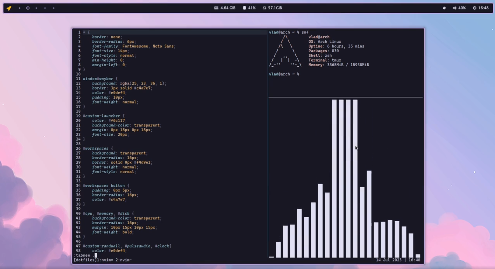
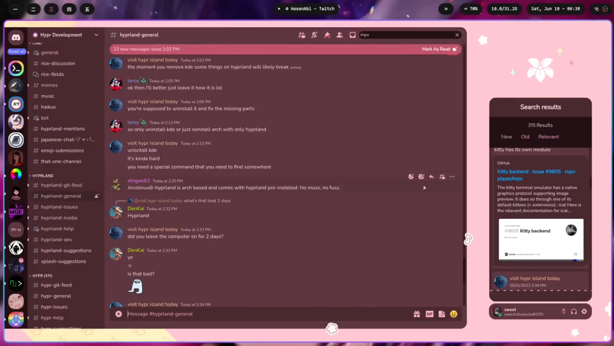

## Razones para usar Linux

Puede ser complicado dar el paso, al no ser algo que veas que mucha gente use, pero te aseguramos tiene ventajas interesante :3

- [x] **Mejor rendimiento** 📈
  
  De forma general, Linux utiliza menos recursos para funcionar que Windows o Mac. Aunque algunas distros y configuraciones de escritorio utilizan más que otras.

- [x] **No virus** 🦠
  
  Al ser utilizado tambien en servidores, muchas empresas y personas aficionadas velan por resolver fallos de seguridad de linux. Además que los hackers no suelen molestarse en hacer virus que corran en Linux jaja.

- [x] **Aprendizaje** 🎓
  
  Usarlo te enseñara mucho sobre como funcionan sistemas operativos. Y podrás usar estos conocimientos para resolver problemas que tengas en otros OS.

- [x] **Personalización ilimitada** 💅
  
  Linux es un sistema operativo altamente personalizable. Lo mejor de todo es que no necesitas configurar todo desde 0, puedes incluso copiar la configuración de alguien más y solo cambiarle lo que necesitas para hacerla tuya

**Ejemplos de Linux super personalizados**:

| Distro                                                                                                                 | Foto                                                                                              |
|:----------------------------------------------------------------------------------------------------------------------:|:-------------------------------------------------------------------------------------------------:|
| [[Hyprland] NixOS + Catppuccin](https://www.reddit.com/r/unixporn/comments/15ajasd/hyprland_nixos_catppuccin/)         |  |
| [[ Hyprland + Waybar + RosePine ]](https://www.reddit.com/r/unixporn/comments/15owp5j/hyprland_waybar_rosepine/)       |             |
| [[Hyprland] Waydroid](https://www.reddit.com/r/unixporn/comments/146j8gx/hyprland_waydroid_is_amazing_feat_my_custom/) |             |

## Alternativas a los programas cotidianos

Para la persona promedio, la mayor desventaja que supone el cambiarse a Linux es la falta de soporte de parte de Microsoft para Linux en lo que a Word, Excel y Power Point respecta. Sin embargo, existen alternativas, como lo son:

- [Google docs](https://www.google.com/docs/about/), [sheets](https://www.google.com/sheets/about/) y [slides](https://www.google.com/slides/about/).
- [OnlyOffice](https://www.onlyoffice.com/es/).

❗️**Importante:** Si haces diseño gráfico o edición de video lígera, existen buenas alternativas gratis, pero para cosas más serias Windows y Mac siguen llevando la delantera. Algunos que recomendamos son :

- [Krita](https://krita.org/es/) (Entorno de dibujo)
- [DaVinci](https://www.blackmagicdesign.com/products/davinciresolve) (Editor de Videos)
- [KdenLive](https://kdenlive.org/es/) (Editor de Videos)

❗️**Importante:** Si eres gamer, no te recomendamos cambiarte por completo a Linux (por ejemplo ninguna distro corre Valorant, debido al Vanguard), puedes intentar usar una instalación dual (Dual Booting) como hablamos en la sección de [Instalación](Formas-de-Instalación) que otras.
