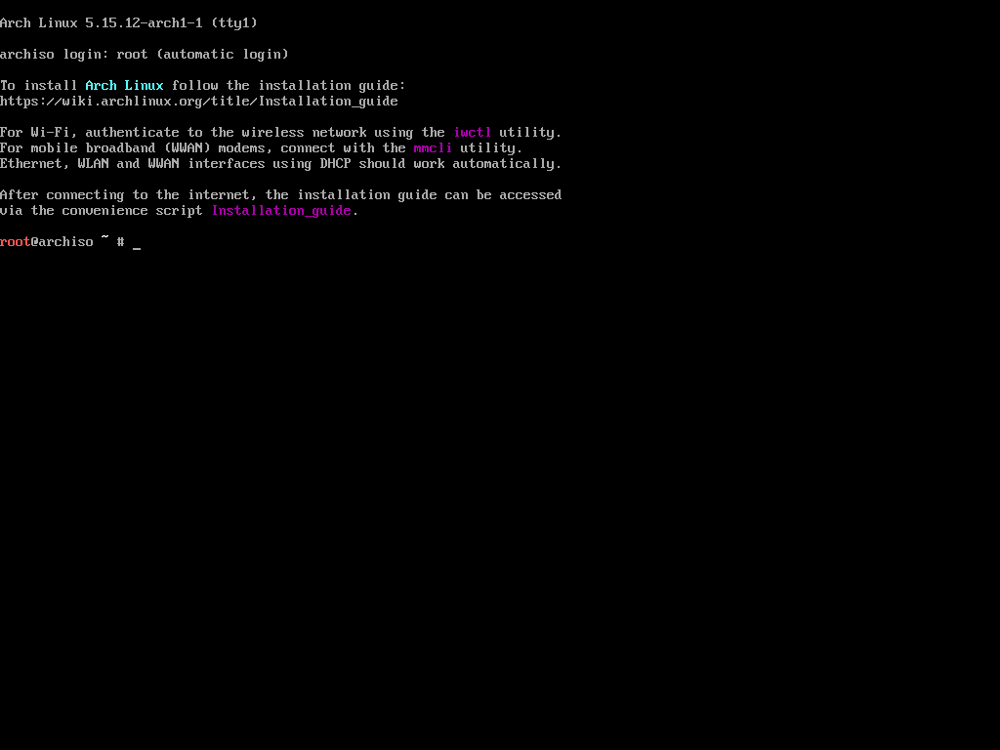
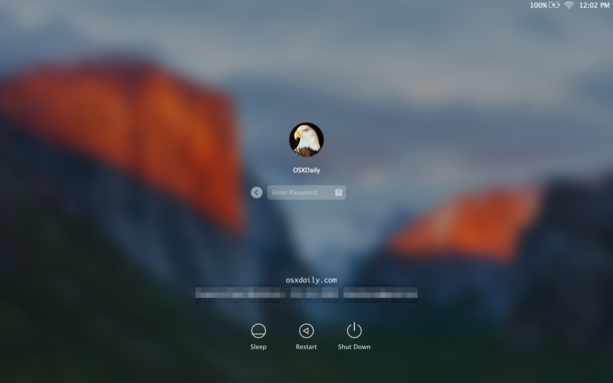
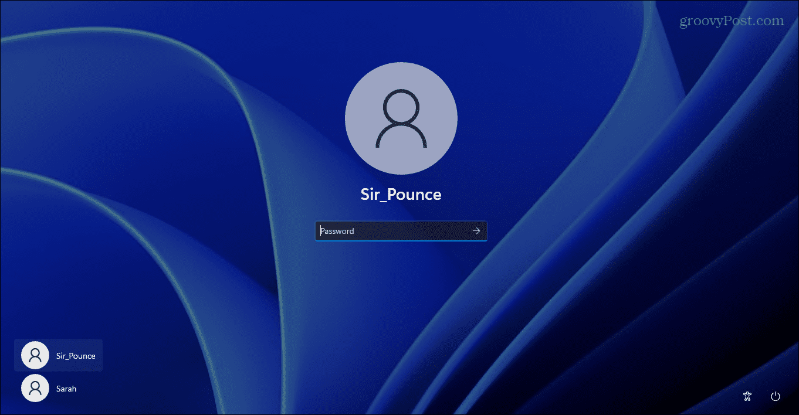
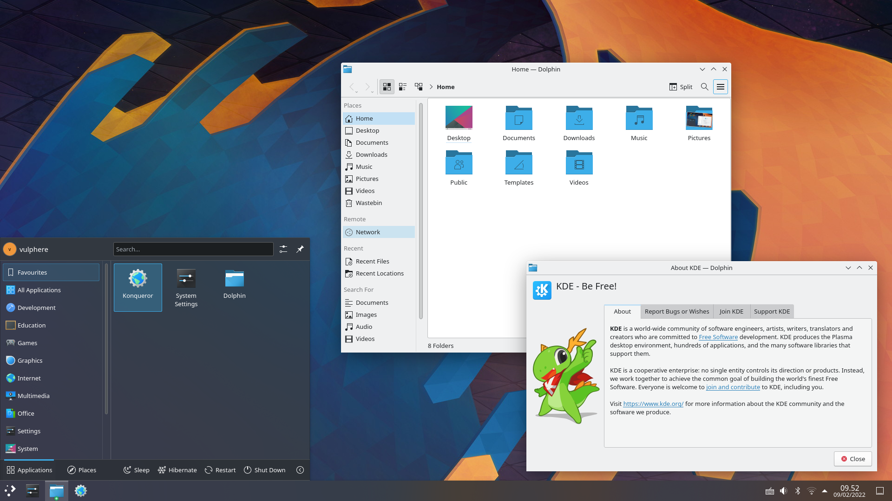
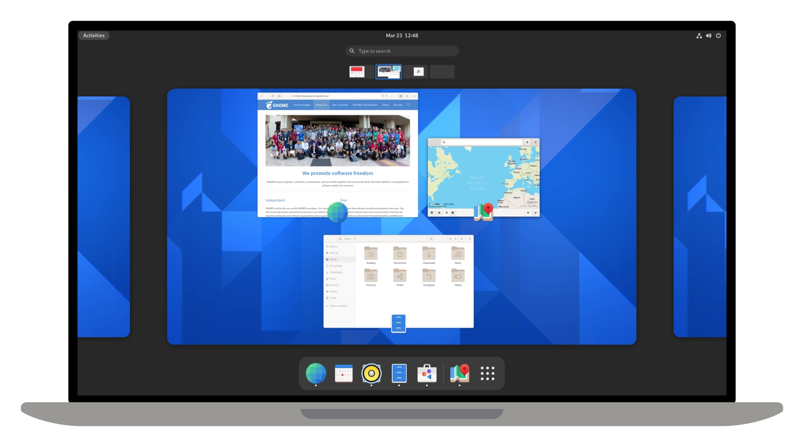
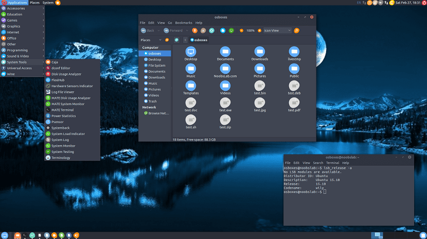
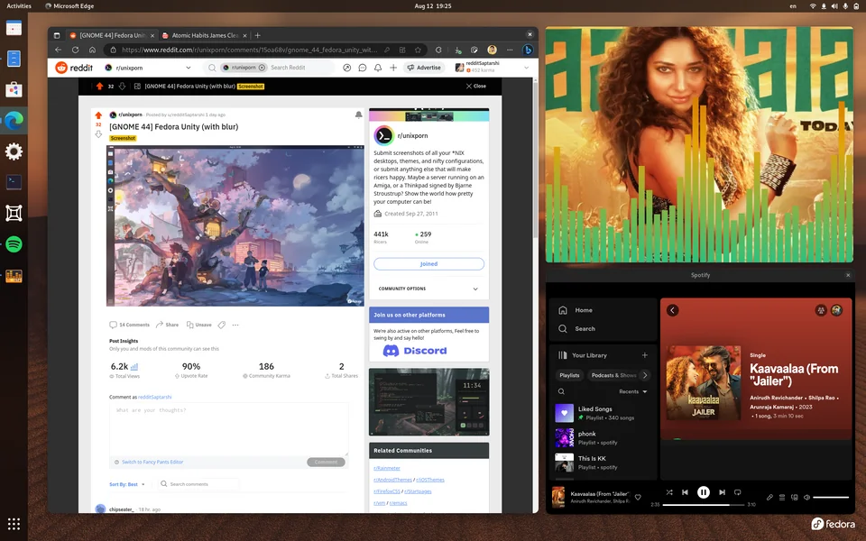
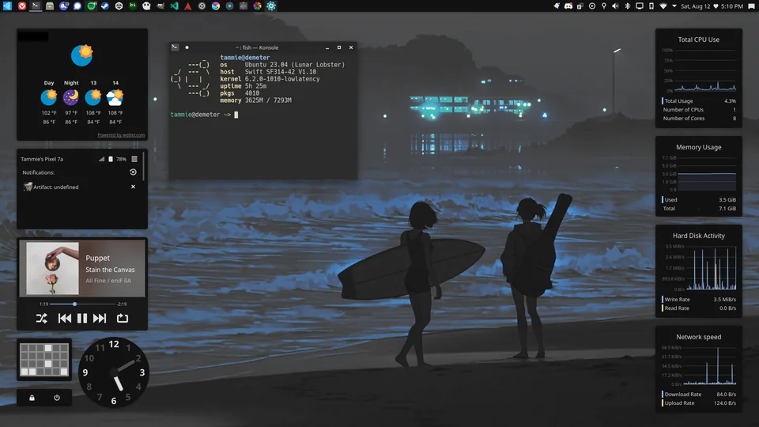

Muy bonito Linux y todo pero, qué es? Bueno, pues [Linux](https://es.wikipedia.org/wiki/GNU/Linux) es un sistema operativo al igual que Windows y MacOS con algunas diferencias clave, por ejemplo: Linux es un sistema operativo completamente a código abierto lo que significa que cualquier persona [puede ver y sugerir cambios al código de Linux](https://github.com/torvalds/linux). 

Aunque esto puede parecer una desventaja y una clara falla de seguridad para el sistema, realmente es todo lo contrario, ya que puesto de manera simple, hay muchísimos más ojos observando y atentos a cualquier bug que hay en Linux, de los que hay de parte de Apple o Microsoft para sus respectivos sistemas operativos. Esto permite una mayor rapidez para arreglar los bugs ya que cualquiera puede sugerir un cambio que arregle el problema, además de una transparencia casi total en cuanto a decisiones y cambios al sistema se refiere.

Ahora que ya sabemos qué es Linux y por qué es seguro, te explicaremos algunos términos importantes de entender sobre el mundo de Linux. Para entender estos términos y el papel que juegan dentro del sistema, es necesario primero entender qué es un sistema operativo.

## ¿Qué es un sistema operativo?

Un sistema operativo es a grandes rasgos un software que se encarga de proveer una plataforma que una el hardware de tu computadora con las aplicaciones que va a correr. Estas aplicaciones pueden ser instaladas por tí (como lo son Discord o Chrome) o pueden venir preinstaladas con tu sistema operativo.

Linux en sí mismo, está diseñado para ser lo más extensible y general posible, **por lo que por defecto no trae más que lo estrictamente necesario para funcionar.** Esto quiere decir que una instalación de Linux puro tiene un look muy distinto del que podrías estar acostumbrado si solamente has usado Windows y MacOS.

En las imágenes inferiores puedes ver una comparación de una instalación de Windows, MacOS y Linux en su estado _más natural_.

**Linux**

Pantalla de inicio de sesión de la [distro](#qué-es-una-distro) Arch (veremos que es una distro más adelante)

**MacOS**

Pantalla de inicio de sesión de MacOS.

**Windows**

Pantalla de inicio de sesión de Windows.

Como puedes observar, la pantalla de inicio de sesión de Linux por defecto no es muy amigable, sin embargo, esto es completamente arreglado por la enorme comunidad de Linux, las cuales crearon aplicaciones (en el mundo de Linux se le llaman paquetes) que te permiten tener un inicio de sesión según el estilo que tú prefieras.

Como te puedes imaginar, el tener que instalar y configurar estos paquetes individualmente para construir prácticamente tu propio sistema desde 0 puede llegar a ser tedioso, por lo que las **distros** nacieron.

## ¿Qué es una Distro?

Las distribuciones (distros) de Linux son sistemas operativos Linux que tienen varios programas y recursos preinstalados y configurados, de esta forma el usuario final no tiene la tarea monumental de instalar y configurar todas las aplicaciones básicas para simplemente mostrar una ventana. Algunas son orientadas a artistas, programadores, fans de anime, al oficinista o incluso a hackers!

Hay una distro para todos los gustos solo es de que encuentres la tuya :D , puedes ver nuestra sección de [recomendaciones](Distros-Recomendadas) para encontrar una con la que puedas iniciar y probar Linux, te animamos a explorar cuantas quieras, mientras más uses más probable es que encuentres la que es perfecta para tí.

## ¿Qué es un Package Manager?

A propósitos prácticos: es tu App Store 📦, a partir de el instalarás y actualizarás programas y recursos del sistema (Tambien conocidos como paquetes).

❗️**Importante:** Generalmente se utilizan desde la terminal aunque varias distribuciones de Linux tienen una aplicación con interfaz gráfica que puedes usar en su lugar.

❗️**Importante:** El package manager puede cambiar entre distro y distro, algunas distros tienen acceso a más paquetes que otras. Todas las distros en nuestra sección de [recomendaciones](Distros-Recomendadas) tienen acceso a una gran variedad de paquetes, por lo que no tendrás que preocuparte de no poder instalar Discord o Google Chrome dentro de tu computadora.

## ¿Qué es un Desktop Environment?

Este programa (o colección de programas) tiene como tarea manegar la interfaz gráfica del OS (manejar tus ventanas, tu fondo de pantalla, tu barra de tareas, animaciones...).

Existen varios tipos, tu distro generalmente viene con alguno de estos ya preinstalados o puede darte la opción a elegir cuál prefieres que te instale.

A continuación te presentamos algunos entornos de escritorio que existen en Linux:

[**KDE Plasma**](https://kde.org/es/plasma-desktop/)

[**GNOME**](https://www.gnome.org/)

[**MATE**](https://mate-desktop.org/)

Hay muchos más, algunos permiten más configuraciones que otros. Te recomendamos explorar para poder encontrar cuál de todos te gusta más!

## ¿Qué es un Window Manager?

Programa fundamental del [Desktop Environment](%C2%BFqu%C3%A9-es-un-desktop-environment%3F) que decide el lugar de la pantalla en que se mostrará cada ventana, sus dimensiones, animaciones, color entre otras cosas...

**Existen dos filosofías** que se han desarrollado dentro de los administradores de ventanas:

| Tiling Window Manager                                                    | Floating Window Manager                                             |
| ------------------------------------------------------------------------ | ------------------------------------------------------------------- |
|  |  |

* **Tiling Window Managers (Administradores de ventana de tipo mosaico)**: Administran la posición y tamaño de las ventanas por tí, su objetivo es que uses el 100% de tu pantalla sin importar cuáles o cuántas ventanas tengas abiertas al mismo tiempo, además tienden a ser más rapidos y consumir menos recursos.
* **Floating Window Managers (Administradores de ventana de tipo flotante)**: Las ventanas flotan una sobre otras, los administradores de ventanas de Windows y MacOS son de este tipo, por lo que ya estarás familiarizado con su funcionamiento.

Hay algunos Window Managers híbridos, que te permiten usar algunas ventanas de manera flotante o incluso, cambiar totalmente a modo flotante según tu desees, las posibilidades son ilimitadas!

 ❗️**Importante:** No todos los administradores de ventanas son compatibles con todos los entornos de escritorio. Puedes tener varias combinaciones de Entornos de escritorios y Window managers e intercambiarlos cuando quieras en tu computadora, pero tendrás que verificar si pueden coexistir en el mismo OS.

Todas las [recomendaciones de distros](Distros-Recomendadas) que nosotros damos tienen un Floating Window Manager por defecto, aunque algunas tienen la opción de instalarse con un Tiling Window Manager en su lugar.

Ordenados de menor a mayor dificultad de configuración, estos serían algunos de los más conocidos:

* [**QTile**](https://qtile.org/)
* [**I3**](https://i3wm.org/)
* [**bspwm**](https://github.com/baskerville/bspwm)
* [**Sway**](https://swaywm.org/)
